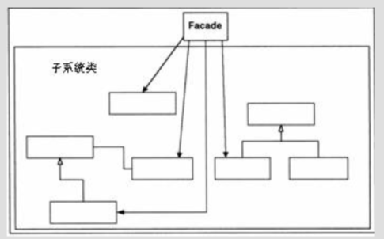
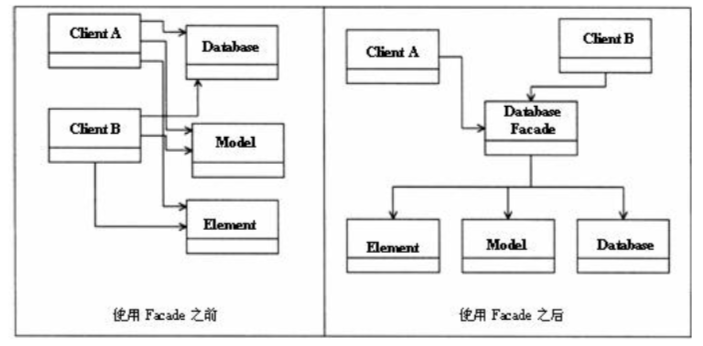

## Facade模式

| 项目           | 描述                                                  |
| -------------- | ------------------------------------------------------------ |
| 名称           | Facade(外观)                                          |
| 意图           | 简化原系统的使用方式                                         |
| 问题           | 只需要使用某个复杂系统的子集，或者，需要以一种特殊的办法与系统交互 |
| 解决方案       | 为子系统中的一组接口提供一个统一接口                         |
| 参与者和协作者 | 简化接口，使系统更容易使用。                                 |
| 效果           | 简化了对所需子系统的使用过程。不完整，因此客户可能无法使用某些功能。 |
| 实现           | 定义一个(或多个)具备所需接口的新类 让新的类使用原有的系统。 |
| 一般性结构     |                 |

* **实践注解**

> 实际上就是创建了一个新的接口供客户使用，来代替系统的原有接口。
> 之所以能够这样做，是因为 Client 对象并不需要原系统提供的所有功能。

* Facade 模式可以应用于:
  * 不需要使用一个复杂系统的所有功能，而且可以创建一个新的类，包含访问系统的所有规则。 如果只需要使用系统的部分功能 ( 这是通常的情况，) 那么你为新类所创建的 API 将比原系统的 API 简单得多。 
  * 希望封装或者隐藏原系统。
    * 跟踪系统的使用情况
    * 切换系统
  * 希望使用原系统的功能，而且还希望增加一些新的功能。
  * 编写新类的成本小于所有人学会使用或者未来维护原系统上所需的成本。 

