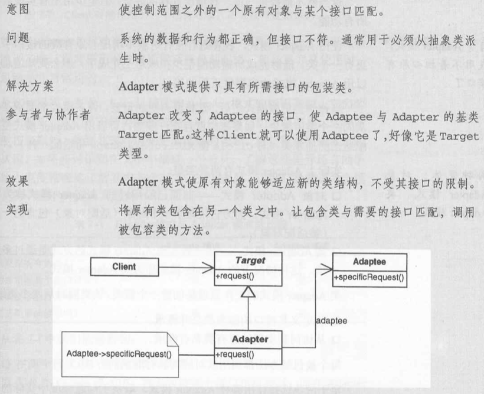

## Adapter模式

| 项目           | 描述                           |
| -------------- | ------------------------------ |
| 名称           | Adapter(适配器)                |
| 意图           | 将一个已有接口转换成另一个接口 |
| 问题           |                                |
| 解决方案       |                                |
| 参与者和协作者 |                                |
| 效果           |                                |
| 实现           |                                |
| 一般性结构     |                                |

* **实践注解**

。

