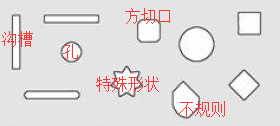
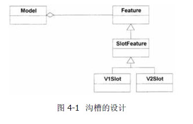
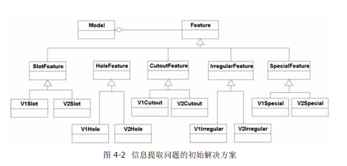

# 传统设计的局限

[TOC]

## 编写一个从CAD系统中提取信息的软件

一个计算机辅助设计系统(CAD)，工程师使用它设计金属板材零件图。

一个专家系统，根据从CAD系统中提取的信息，控制零件的制造流程。

**我的任务**

从CAD系统中提取信息。

**了解专业术语**

* 金属板材上的形状

| 术语                | 描述                                     |
| ------------------- | ---------------------------------------- |
| 沟槽（slot）        | 用铣刀切成                               |
| 孔（hole）          | 用不同宽度的钻头钻出来                   |
| 方切口（cutout）    | 高压冲床以巨大冲力在金属上冲出来的       |
| 特殊形状（special） | 预制形状。需要制造特殊冲头，进行快速冲压 |
| 不规则（irregular） | 用几种工具组合起来切割而成的。           |

* 更多术语

| 术语                             | 描述                                                     |
| -------------------------------- | -------------------------------------------------------- |
| 几何特征（geometry）             | 金属板材的外观描述：每个部件的位置和尺寸，金属板材的外形 |
| 零件（part）                     | 金属板材本身。我需要能够存储每个零件的几何特征           |
| 模型（model）或数据集（dataset） | CAD数据库中存储零件几何特征的记录集                      |

## 对代码灵活性要求很高的问题

**问题描述**

专家系统可以打开并读取一个模型，其中包含我要分析的零件的几何特征，然后生成命令，让数控机床控制各种切削头切割金属制造金属板材。

上图为正确的零件制作方法：

1. 先是冲床开方切口，因为先开沟槽会导致金属板材的强度降低而变形。
2. 开垂直沟槽
3. 开水平沟槽

系统要执行以下步骤：

1. 分析金属板材。
2. 根据板材所含部件，确定制造方式。
3. 生成制造设备可读的指令集。这种指令集称为数控集。
4. 在需要制造某个零件时，就将对应指令提供给制造设备。

任务的难点在于：要用什么类型的命令和命令的顺序，都取决于部件及其与其他部件的关系。

**挑战**

CAD系统有V1、V2两个版本，且模型无法转换。

在几何特征提取程序一层上多态性肯定需要，但在部件一层上则不然，这
是因为专家系统需要知道所处理的部件类型。无论如何，CAD系统的第三
个版本推出时，我们不希望还对专家系统进行修改。

1. V1版本获取模型信息，必须进行一系列的查询，如下：
   1. 得到模型句柄
   2. 查询所包含的部件ID
      1. 查询部件的类型
      2. 判断类型，确认调用例程
      3. 完成部件相关的每次调用
2. V2版本是面向对象几何特征的，可以获得与金属板材的部件相对应的一组对象。

## 标准的面向对象解决方案

考虑沟槽时，我发现能够很容易地特化每一种情况。也就是说，我可以创建一
个SlotFeature 类，在使用V1 系统时从该类派生一个类，在使用V2 系统时从
该类派生另外一个类。如图4-1 所示。

将这一方法推广到所有部件类型上，解决方案就完成了。

我这个解决方案并非上策：想像一下吧，一旦要改用CAD系统的第三个版本，情况会怎样？

> 分析陷阱：过早过多地关注细节
>
> 在本例中，我已经实现了一个目标：为部件信息提供了一个公用的API。
> 我还从责任的角度定义了对象。但是，这样做的代价是所有东西都要作为特例。
> 如果有了新的特例，我还要如法炮制地将它实现一遍。因此，维护代价太高了。

