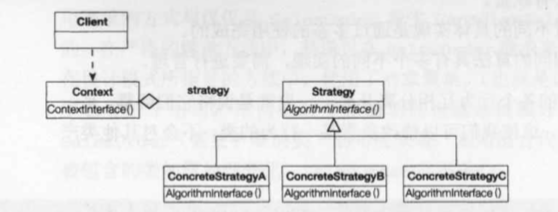
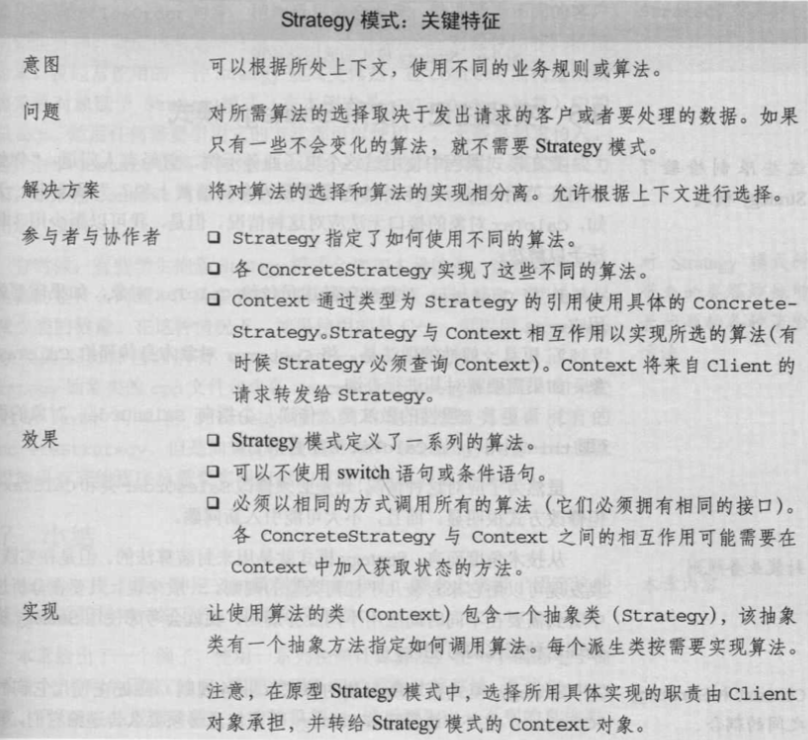
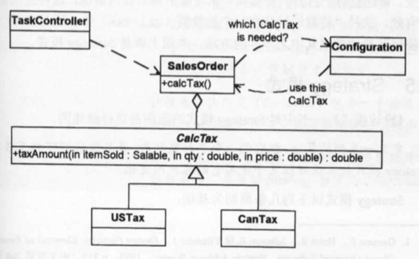

## Strategy模式

| 项目           | 描述                                                  |
| -------------- | ----------------------------------------------------- |
| 名称           | Strategy(策略)                                        |
| 意图           | 封装算法，对象的职责不同使用多态完成                  |
| 问题           |                                                       |
| 解决方案       |                                                       |
| 参与者和协作者 |                                                       |
| 效果           |                                                       |
| 实现           |                                                       |
| 一般性结构     |  |

* **实践注解**

封装变化的地方，优先考虑使用聚集。

