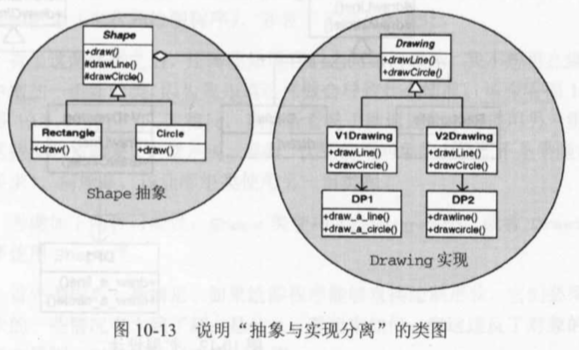

## Bridge模式

| 项目           | 描述                                                         |
| -------------- | ------------------------------------------------------------ |
| 名称           | Bridge(桥接)                                                 |
| 意图           | 将一组实现与另一组使用它们的对象分离                         |
| 问题           | 一个抽象类的派生类必须使用多个实现，但不能出现类的数量爆炸增长 |
| 解决方案       | 为所有实现定义一个接口，供抽象类的所有派生类使用             |
| 参与者和协作者 |          |
| 效果           | 实现与使用实现的对象解耦，提供了可扩展性，客户对象无需操心实现问题。 |
| 实现           | 将实现封装在一个抽象类。 在要实现的抽象的基类中包含实现的句柄。 |
| 一般性结构     |           |

* **实践注解**

