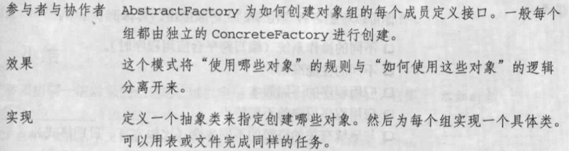
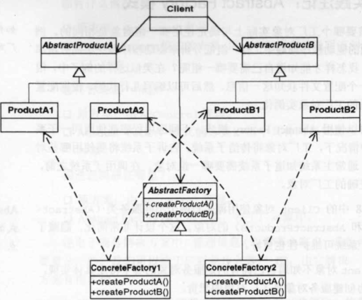

# Abstract Factory模式

| 项目           | 描述                                                         |
| -------------- | ------------------------------------------------------------ |
| 名称           | Abstract Factory(抽象工厂)                                   |
| 意图           | 需要为特定的客户(或情况)提供对象组                           |
| 问题           | 需要实例化一组相关的对象                                     |
| 解决方案       | 协调对象组的创建。提供一种方式，将如何实现对象实例化的规则从使用这些对象的客户对象中提取出来 |
| 参与者和协作者 |  |
| 效果           |                                                              |
| 实现           |                                                              |
| 一般性结构     |  |

- **实践注解**

