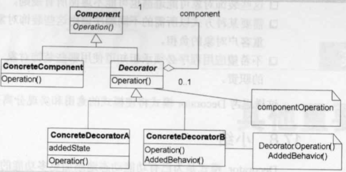
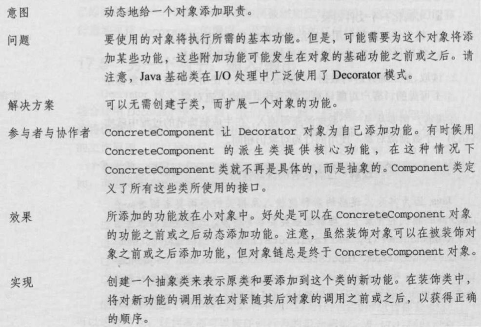

## Decorator模式

| 项目           | 描述                                                    |
| -------------- | ------------------------------------------------------- |
| 名称           | Decorator(装饰者)                                       |
| 意图           |                                                         |
| 问题           |                                                         |
| 解决方案       |                                                         |
| 参与者和协作者 |                                                         |
| 效果           |                                                         |
| 实现           |                                                         |
| 一般性结构     |  |

- **实践注解**

