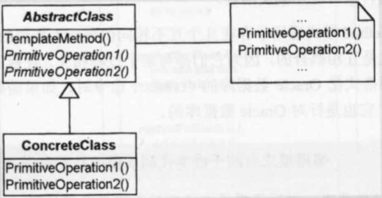
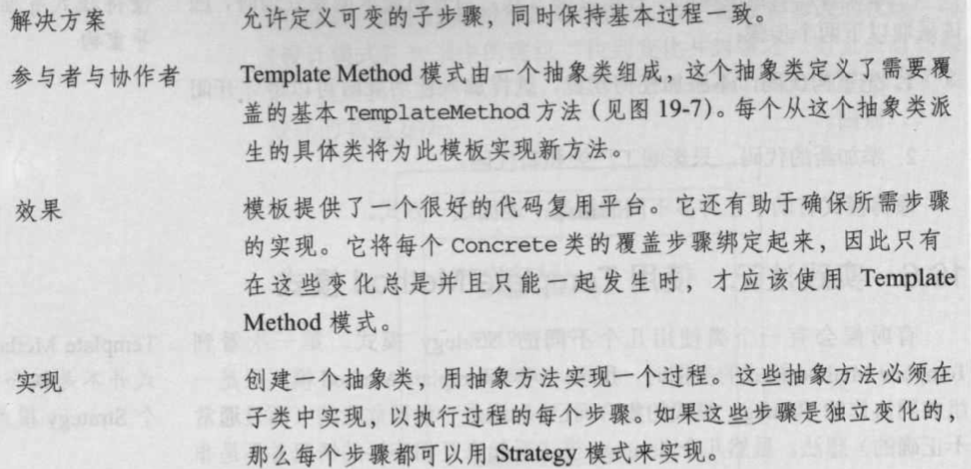
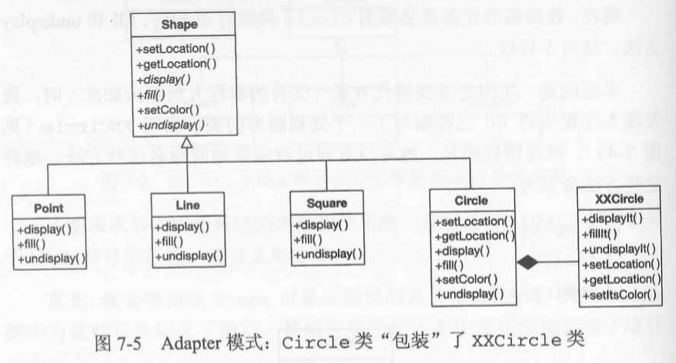

## Template Method模式

| 项目           | 描述                                                         |
| -------------- | ------------------------------------------------------------ |
| 名称           | Template Method(模板方法)                                    |
| 意图           | 定义一个操作中算法的骨架，将一些步骤推迟到子类中实现。可以不改变算法的结构而重定义该算法的步骤。 |
| 问题           | 要完成在某一细节层次一致的一个过程或一系列步骤，但其个别步骤在更详细的层次上的实现可能不同。 |
| 解决方案       | 允许定义可变的子步骤，同时保持基本过程一致。                 |
| 参与者和协作者 |                                                              |
| 效果           |                                                              |
| 实现           |                                                              |
| 一般性结构     |  |

- **实践注解**

