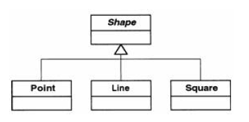
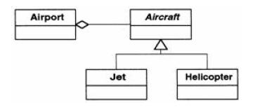
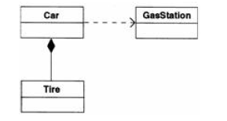
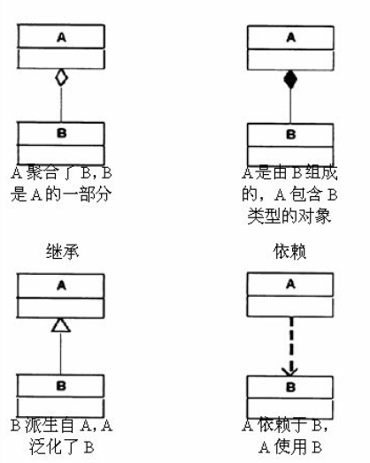

# UML

[TOC]

* **主要是用来交流的**
  
  * 在软件开发领域中糟糕的需求无处不在，而UML 为我们提供了提高需求质量的工具。
  
* 有利于清晰
  
  * 用来确定我对系统的理解是否与其他人相同
  
* 有利于精确
  * 它还使设计人员能够仔细考虑其设计中类之间的关系（因为必须将设计写下来）
  * 在概念层次描述通常也比在代码(即实现)层次描述更好。
  


| 当你在......                       | 所使用的 UML 图                                              |
| ---------------------------------- | ------------------------------------------------------------ |
| 分析阶段                           | 用例图，涉及的是与系统(也就是用户和其他的系统)之间 交互的实体，以要实现的功能点 <br>活动图，关注的是问题领域[人和其他主体(agent)工作空间，程序]的工作流，而不是程序的逻辑流 |
| 观察对象的交互                     | 交互图，说明了特定对象如何互相交互。因为它们处理的都是 具体情况而不是一般情况， 所以在检查需求和设计时都很有用。 最常见的一种交互图是顺序图 |
| 设计阶段                           | 类图，详细描述了类之间的关系                                 |
| 观察对象所处状 态不同时行为的 差异 | 状态图， 详细描述了对象可能所处的不同状态以及在这些态状之间的转换 |
| 配置阶段                           | 部署图，说明了如何部署不同模块。                             |


### 类图

* 当一个类是“一种”另一个类时:is-a(是一种/一个)关系。 

  * 带三角箭头的实线，箭头指向父类
  
    


* 当两个类之间存在关联时: 
  * 一个类“包含”另一个类:has-a(拥有一个)关系; 

    * 空心菱形表示聚集关系(比如：机场可以拥有喷气飞机或直升机，但它是以相同的方式对待它们的)，**我理解的是包含抽象类或接口的引用就是聚合**

    

    

    * 实心菱形表示组合关系(比如：汽车拥有轮胎)

      

  * 一个类“使用”另一个类:use-a(使用一个)关系; 

    * 带箭头的虚线表示，也称依赖关系(比如：上图，汽车使用加油站类)

  * 一个类“创建”另一类。 

“什么东西包含另一个东西”时， 我们可能是指:

* 组合(composition)，被包含者是包含者的一部分(比如汽车中的发动机)。
* 聚集(aggregation)有一个集合，集合中东西可以独立存在(比如机场上的飞机)。

| 类的信息 | 矩形表示一个类  |
| -------- | --------------- |
| 类名     | Square          |
| 数据成员 | -length: double |
| 方法     | +display()      |

#### 方法和属性的访问权限

| 标识 | 属性            |
| ---- | --------------- |
| -    | private         |
| #    | protected       |
| +    | public          |
| ~    | package private |

#### 表示关系的记号



### 交互图

> 表示对象间如何交互的UML 图称为交互图（interaction diagram）

最常用的交互图是**顺序图**，如图:


* 每个矩形都代表一个特定的对象。注意在类名前有一个冒号(“对象:类”记号)

* 垂直线代表对象的生命线
* 垂直线之间的水平线表示对象互相发送消息
* 在最上面可以看见Main 向ShapeDB 对象（这个对象还没有名字）发送了一个“获取形状集合”的消息。
* 在收到“获取形状集合”的请求之后，ShapeDB 对象将：
  * 实例化一个Collection 对象；
  * 实例化一个Square 对象；
  * 在集合中添加Square 对象；
  * 实例化一个Circle 对象；
  * 在集合中添加Circle 对象；
  * 将集合返回给调用例程（Main）。

当对象互相“交谈”时，我们称之为“发送消息”。你需要给一个对象发送请求，让它进行某种操作，而不是告诉其他对象做什么，其他对象会负责搞清楚如何去做。转移责任是面向对象程序设计基本原则之一。


### Markdown的UML语法

[原文：Markdown 之 UML图的实用画法](https://blog.csdn.net/sun8112133/article/details/79891479)

[在线画图工具](<http://plantuml.com/zh/>)

* 序列图

``` sequence
title: 三个臭皮匠的故事
participant 小王
participant 小李
participant 小异常

note left of 小王: 我是小王
note over 小李: 我是小李
note right of 小异常: 大家好！\n我是小异常

小王->小王: 小王想：今天要去见两个好朋友咯~
小王->小李: 嘿，小李好久不见啊~ 
小李-->>小王: 是啊
小李->小异常: 小异常，你好啊
小异常-->小王: 哈，小王！\n最近身体怎么样了？
小王->>小异常: 还可以吧
```

  1. 关键字
        1. title	表示该序列图中的标题。
        2. participant	表示该序列图中的对象。
        3. note	表示该序列图中的部分说明。
        
          关于note以下三种关键字：
        
  - left of：表示在当前对象的左侧。 
          - right of：表示在当前对象的右侧。
          - over：表示覆盖在当前对象的上方。
        
  2. 箭头
      1. ->：实线实箭头
      2. –>：虚线实箭头
      3. ->>：实线虚箭头
      4. –>>：虚线虚箭头
  3. 换行

    如果当前行中的文字过多想要换行，可以使用 \n 进行转义换行，效果如以上例子。

* 流程图

``` flow
st=>start: 开始
e=>end: 结束
com=>operation: 开始评论
cond=>condition: 确认评论？
st->com->cond
cond(yes)->e
cond(no)->com
```

1. 关键字
   　　1）start, end
      　　表示该流程图中的开始与结束。

      　　2）operation
      　　表示该流程图中的处理块。

      　　3）subroutine
      　　表示该流程图中的子程序块。

      　　4）condition
      　　表示该流程图中的条件判断。

      　　5）inputoutput
      　　表示该流程图中的输入输出。

      　　6）right, left
      　　表示该流程图中当前模块下一个箭头的指向（默认箭头指向下方）。

      　　7）yes, no
      　　表示该流程图中条件判断的分支（默认yes箭头向下no箭头向右；yes与no可以和right同时使用；yes箭		头向右时，no箭头向下）

2. 各模块之间的联系
   　　1）形式：
      　基本形式：`模块标识=>模块关键字: 模块模块名称`

      　连接定义：
       ```
       模块标识1->模块标识2
       模块标识1->模块标识2->模块标识3
       ```
      　　2）说明：
      　　通过模块与连接定义，可以组成一个完整的流程图。 
      　　在模块定义中，模块标识与模块名称可以自定义，模块关键字不可以自定义！

3、注意事项
　　  1）在进行连接的时候，可以通过right, left确定箭头的指向；
　　  2）使用条件判断的连接时需要结合yes和no进行；
          3）在连接各模块之间不能有空格，在模块标识关键字时也不能有空格。


